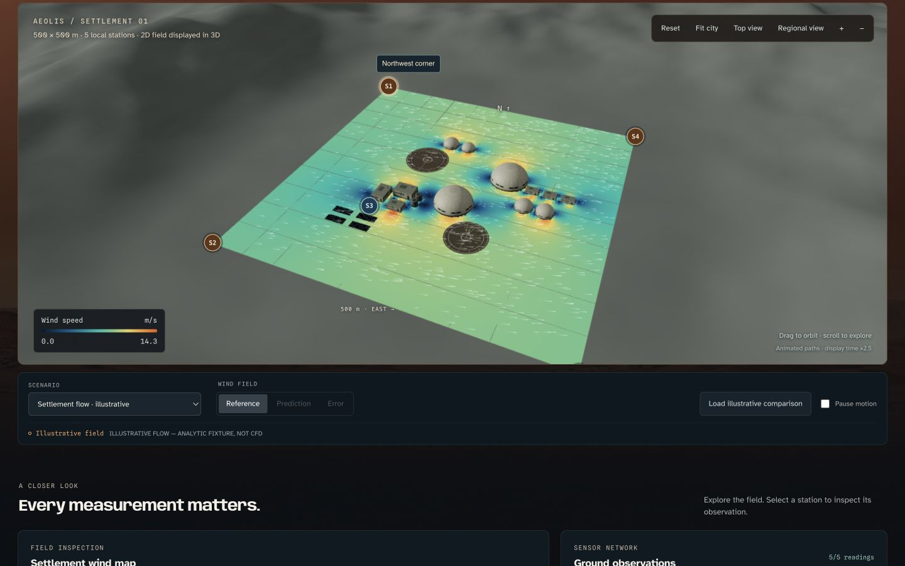
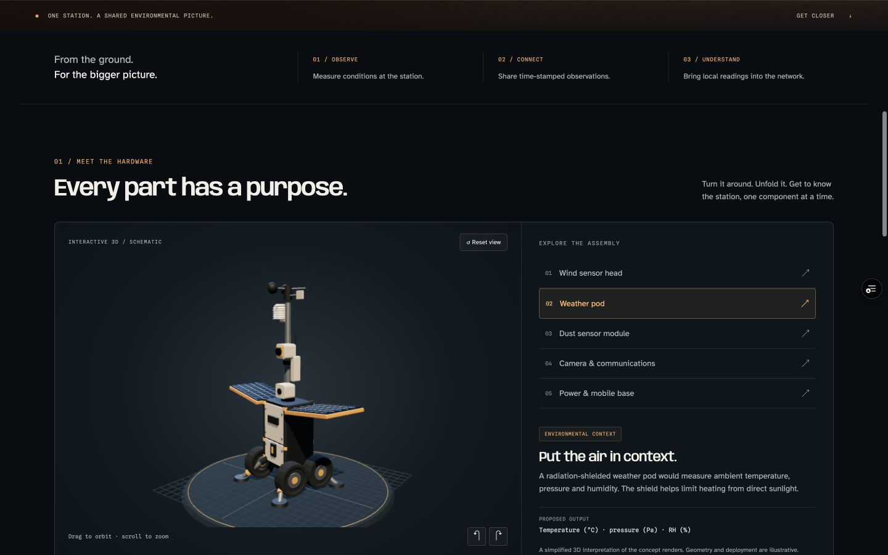
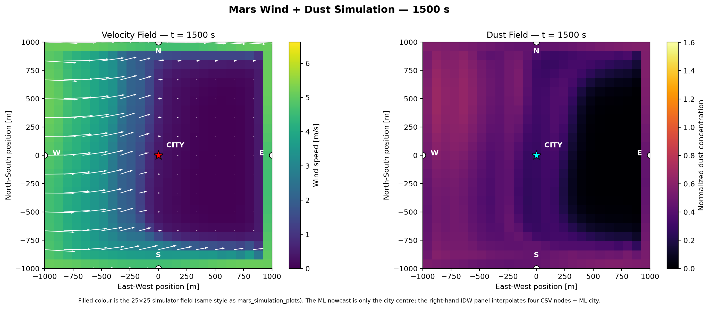
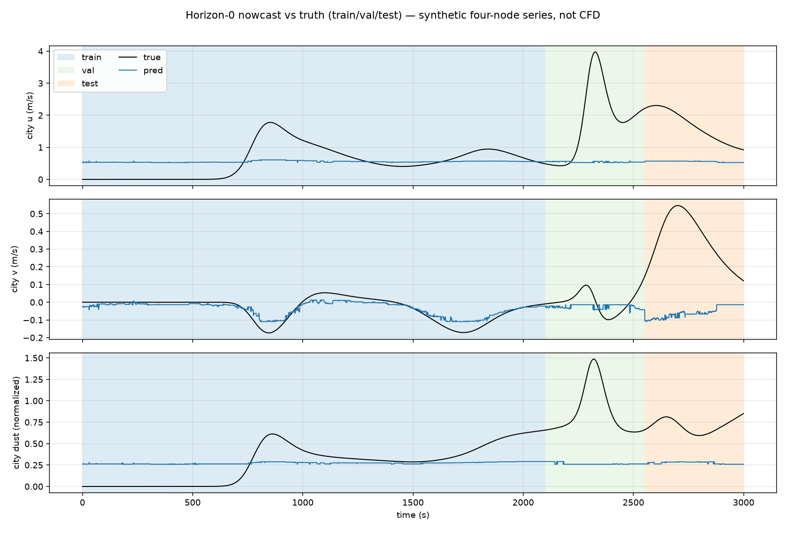

# MarsWindNet

**See the wind. Protect the city.**

MarsWindNet explores how a network of environmental sensors could help people understand wind around a Martian settlement. Built for the Mars City Hackathon, it brings together an interactive city, a sensor hardware concept and the team's simulation and machine-learning results.

**[Visit MarsWindNet](https://marswindnet.vercel.app/)** · **[Meet the sensor](https://marswindnet.vercel.app/sensor/)** · **[View model results](https://marswindnet.vercel.app/ml-gallery/index.html)**

[](https://marswindnet.vercel.app/#demo)

*The working 3D city: procedural architecture, wind contours and linked sensor monitoring. Shown with the labelled illustrative flow fixture.*

## From sensing to prediction

**Sense the environment → learn from simulations → inspect the results.**

[](https://marswindnet.vercel.app/sensor/)

*Explore the sensor concept in 3D: rotate the station, select its instruments and fold it for transport.*

## A look at the results

### Simulated wind and dust

[](https://marswindnet.vercel.app/ml-gallery/index.html)

*Spatial fields from the team's synthetic 25 × 25 simulation. These are simulation illustrations, not validated CFD results.*

### What the ML predicts

[](https://marswindnet.vercel.app/ml-gallery/index.html#s3)

*XGBoost estimates city-centre wind components and dust. This comparison shows the current model's limitations as well as its predictions; it is not a full-field ML reconstruction.*

**[Open the full results gallery →](https://marswindnet.vercel.app/ml-gallery/index.html)**

## Explore the website

The opening film leads into three parts of the project:

| Experience | What you can explore |
| --- | --- |
| **Interactive city** | A 500 × 500 m settlement with 3D buildings, moving wind trails, a matching 2D map and sensor monitoring. |
| **Sensor showcase** | The proposed field station, its instruments and an interactive 3D model that folds between transport and deployed configurations. |
| **Model results** | A guided modelling story: synthetic simulation, preliminary XGBoost and LSTM predictions, and clearly labelled interpolated maps. |

The city has **Mars**, **CFD** and **Structure** views. Select a sensor to inspect its readings, use **Regional view** to see the wider network, or load an illustrative comparison to explore the comparison controls. On mobile, choose **Interact with city** to enable camera gestures.

Five local stations cover the settlement. A further 24 virtual stations sit on rings at 1, 5 and 10 km from its centre.

## What the demonstration represents

The city initially displays an **illustrative wind field**, not a live trained-model prediction. Its horizontal 2D data is visualised in 3D; the surrounding terrain and dust styling are decorative. The Structure view shows illustrative surface colours, not calculated stress or displacement.

The results gallery is a separate, prepared presentation of the team's work. Those plots are not wired into the interactive city. Read each plot's provenance: synthetic simulation, model output and validated CFD are different things.

The sensor is a hardware concept. The website does not receive physical telemetry or provide validated operational warnings. Live model generation is deferred; the current website works without a Python backend.

## Run locally

Install Node.js 22.18 or newer, then:

```bash
git clone https://github.com/tuntharm/mars-hack-MarsWindNet.git
cd mars-hack-MarsWindNet
npm ci
npm run dev
```

Open the address printed by Vite, normally `http://localhost:5173`.

- City: `/`
- Sensor: `/sensor/`
- Results: `/ml-gallery/index.html` — include `index.html`.

## Project files

| Location | Contents |
| --- | --- |
| `src/` | React application, city renderer, field visualisation and monitoring. |
| `public/sensor/` | Complete standalone sensor showcase, assets and vendored Three.js. |
| `public/ml-gallery/` | Results page and its plot images. |
| `public/data/` | Runtime geometry, demonstration scenarios and geometry exports. |
| `CFD/` | Simulation contribution, geometry specification and field-import tooling. |
| `mars_simulation_plots/` | Simulation figures contributed by the team. |
| `inference-service/` | Prepared full-field model adapter for future integration. |
| `predict-stub/` | Optional IDW development baseline; not a trained model. |
| `docs/` | Dataset provenance, integration notes and verification records. |

The team's additional simulation and LSTM contributions are retained alongside the website.

## Simulation and model handoff

Start with the [city map](CFD/geometry/city-map.svg), [geometry specification](CFD/geometry/README.md) and [CFD instructions](CFD/README.md). The city uses layout **`marswindnet-500-v3`**, 14 projected obstacles and a 128 × 128 cell-centred display grid. The solver's computational mesh may differ.

For future model integration, see the [Python adapter contract](inference-service/README.md) and [hosted integration notes](docs/HOSTED_INFERENCE.md). A compatible numerical full-field output is required; a plot image or a single city-centre prediction cannot drive the whole city field.

See the [dataset catalogue](docs/DATASETS.md) for the bundled data and its limitations.

## Checks and deployment

```bash
npm test
npm run lint
npm run build
npm run check:geometry
```

Vercel serves the built website from `dist/`. The sensor and results pages are included as static assets. The public address is **https://marswindnet.vercel.app/**.
